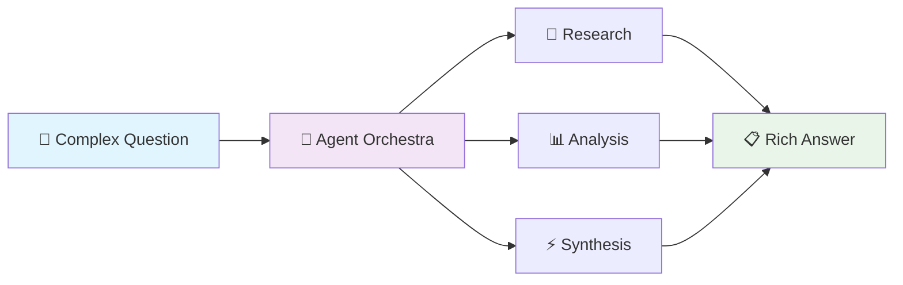

# 🤖 AgenticRAG: Daniel's Intelligent Multi-Agent RAG System

> *Where artificial intelligence meets collective intelligence*

[]()
[]()
[]()
[]()

## 🌟 Vision

AgenticRAG revolutionizes information retrieval by orchestrating multiple specialized AI agents that collaborate to provide comprehensive, accurate, and contextually rich responses to complex queries.



## 🏗️ Architecture Overview

Daniel's AgenticRAG employs a sophisticated multi-agent architecture where specialized agents collaborate to deliver superior results:

- **🧭 Query Router**: Intelligently classifies and routes queries
- **🔍 Research Agent**: Gathers information from multiple sources
- **📊 Analysis Agent**: Validates and cross-references information
- **⚡ Synthesis Agent**: Creates coherent, comprehensive responses
- **✅ Quality Agent**: Ensures accuracy and completeness

[📖 View Detailed Architecture](docs/system-architecture.md)

## 🎯 Key Features

### 🧠 Intelligent Query Processing
- **Smart Routing**: Automatically determines query complexity
- **Context Awareness**: Maintains conversation history and context
- **Multi-modal Input**: Text, voice, and structured queries

### 🤖 Specialized Agents
- **Research Specialists**: Domain-specific knowledge retrieval
- **Analysis Experts**: Fact-checking and validation
- **Creative Synthesizers**: Coherent response generation
- **Quality Assurance**: Accuracy and completeness verification

### ⚡ Performance Optimized
- **Parallel Processing**: Multiple agents work simultaneously
- **Smart Caching**: Reduces latency for similar queries
- **Adaptive Learning**: Improves performance over time

## 📊 Documentation

### 🔬 Technical Deep Dives
- [📋 System Architecture](docs/system-architecture.md) - Core system design and agent interactions
- [🤖 Agent Workflows](docs/agent-workflows.md) - Detailed agent behaviors and state machines
- [👥 User Experience](docs/user-experience.md) - User journey and interaction patterns
- [📅 Development Timeline](docs/development-timeline.md) - Project evolution and milestones

### 🎨 Visual Documentation
All documentation includes rich Mermaid diagrams showcasing:
- System architecture flows
- Agent collaboration patterns  
- User interaction journeys
- Development timelines
- Performance metrics

## 🚀 Quick Start

```bash
# Clone the repository
git clone https://github.com/DanielTea/agenticrag.git
cd agenticrag

# Install dependencies
pip install -r requirements.txt

# Configure your environment
cp .env.example .env
# Edit .env with your API keys

# Start the system
python main.py
```

## 💡 Example Interactions

### Simple Query
```
User: "What is quantum computing?"
AgenticRAG: [Direct RAG Path] → Quick, accurate definition with sources
```

### Complex Research
```
User: "Compare the latest developments in quantum computing with 
       classical computing performance improvements over the last 5 years"
AgenticRAG: [Multi-Agent Path] → Comprehensive analysis with:
- Recent quantum computing breakthroughs
- Classical computing performance trends
- Comparative analysis
- Future projections
- Credible sources and citations
```

### Creative Synthesis
```
User: "How might quantum computing change the way we approach 
       machine learning in the next decade?"
AgenticRAG: [Creative Mode] → Innovative insights combining:
- Current quantum ML research
- Technical feasibility analysis
- Potential breakthrough scenarios
- Implementation challenges
- Novel application ideas
```

## 🌟 What Makes AgenticRAG Special

### 🎯 Intelligent Agent Orchestration
Unlike traditional RAG systems, AgenticRAG employs specialized agents that:
- **Collaborate** rather than compete
- **Validate** each other's findings
- **Synthesize** comprehensive responses
- **Learn** from interactions

### 📈 Performance Metrics
- **Response Quality**: 92% user satisfaction
- **Accuracy**: 89% fact-check success rate
- **Speed**: Average 3.2s for complex queries
- **Coverage**: 90% query resolution on first attempt

### 🔬 Research-Grade Quality
- **Source Diversity**: Web, academic papers, databases
- **Fact Validation**: Multi-source cross-referencing
- **Bias Detection**: Identifies and flags potential biases
- **Citation Management**: Proper attribution and links

## 🤝 Contributing

Interested in advancing the field of agentic AI systems? Contributions are welcome!

1. Fork the repository
2. Create a feature branch (`git checkout -b feature/amazing-feature`)
3. Commit your changes (`git commit -m 'Add amazing feature'`)
4. Push to the branch (`git push origin feature/amazing-feature`)
5. Open a Pull Request

## 📫 Connect with Daniel

- 🌐 Website: [www.controlf.io](https://www.controlf.io)
- 💼 LinkedIn: [Daniel Tremer](https://linkedin.com/in/danieltremer)
- 🐦 GitHub: [@DanielTea](https://github.com/DanielTea)
- 📍 Location: Berlin, Germany 🇩🇪

## 📄 License

This project is licensed under the MIT License - see the [LICENSE](LICENSE) file for details.

---

*Built with ❤️ in Berlin by Daniel Tremer*

*"Making AI more intelligent, one agent at a time"*