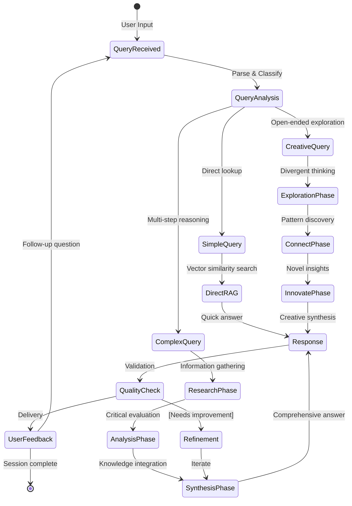
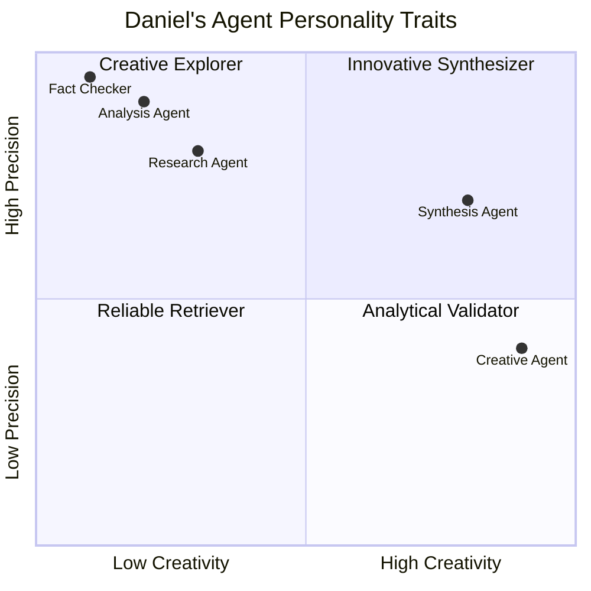
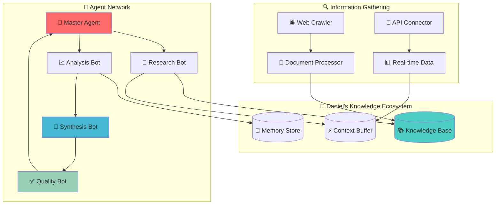

# 🔬 Daniel's Agent Workflow Intelligence

## Agent State Machine

```mermaid
stateDiagram-v2
    [*] --> QueryReceived: User Input
    QueryReceived --> QueryAnalysis: Parse & Classify
    
    QueryAnalysis --> SimpleQuery: Direct lookup
    QueryAnalysis --> ComplexQuery: Multi-step reasoning
    QueryAnalysis --> CreativeQuery: Open-ended exploration
    
    SimpleQuery --> DirectRAG: Vector similarity search
    DirectRAG --> Response: Quick answer
    
    ComplexQuery --> ResearchPhase: Information gathering
    ResearchPhase --> AnalysisPhase: Critical evaluation
    AnalysisPhase --> SynthesisPhase: Knowledge integration
    SynthesisPhase --> Response: Comprehensive answer
    
    CreativeQuery --> ExplorationPhase: Divergent thinking
    ExplorationPhase --> ConnectPhase: Pattern discovery
    ConnectPhase --> InnovatePhase: Novel insights
    InnovatePhase --> Response: Creative synthesis
    
    Response --> QualityCheck: Validation
    QualityCheck --> UserFeedback: Delivery
    QualityCheck --> Refinement: [Needs improvement]
    Refinement --> SynthesisPhase: Iterate
    
    UserFeedback --> [*]: Session complete
    UserFeedback --> QueryReceived: Follow-up question
```

## Agent Personality Matrix

```mermaid
quadrantChart
    title Daniel's Agent Personality Traits
    x-axis Low Creativity --> High Creativity
    y-axis Low Precision --> High Precision
    
    quadrant-1 Innovative Synthesizer
    quadrant-2 Creative Explorer  
    quadrant-3 Reliable Retriever
    quadrant-4 Analytical Validator
    
    Research Agent: [0.3, 0.8]
    Analysis Agent: [0.2, 0.9]
    Synthesis Agent: [0.8, 0.7]
    Creative Agent: [0.9, 0.4]
    Fact Checker: [0.1, 0.95]
```

## Knowledge Flow Network

```mermaid
graph TD
    subgraph "🧠 Daniel's Knowledge Ecosystem"
        KnowledgeBase[(📚 Knowledge Base)]
        MemoryStore[(🧐 Memory Store)]
        ContextBuffer[(⚡ Context Buffer)]
    end
    
    subgraph "🔍 Information Gathering"
        WebCrawler[🕷️ Web Crawler]
        DocProcessor[📄 Document Processor]
        APIConnector[🔌 API Connector]
        RealTimeData[📊 Real-time Data]
    end
    
    subgraph "🤖 Agent Network"
        MasterAgent[👑 Master Agent]
        ResearchBot[🔎 Research Bot]
        AnalysisBot[📈 Analysis Bot]
        SynthBot[🔬 Synthesis Bot]
        QualityBot[✅ Quality Bot]
    end
    
    WebCrawler --> DocProcessor
    DocProcessor --> KnowledgeBase
    APIConnector --> RealTimeData
    RealTimeData --> ContextBuffer
    
    MasterAgent --> ResearchBot
    MasterAgent --> AnalysisBot
    ResearchBot --> KnowledgeBase
    ResearchBot --> ContextBuffer
    AnalysisBot --> MemoryStore
    AnalysisBot --> SynthBot
    SynthBot --> QualityBot
    QualityBot --> MasterAgent
    
    style MasterAgent fill:#ff6b6b
    style KnowledgeBase fill:#4ecdc4
    style SynthBot fill:#45b7d1
    style QualityBot fill:#96ceb4
```