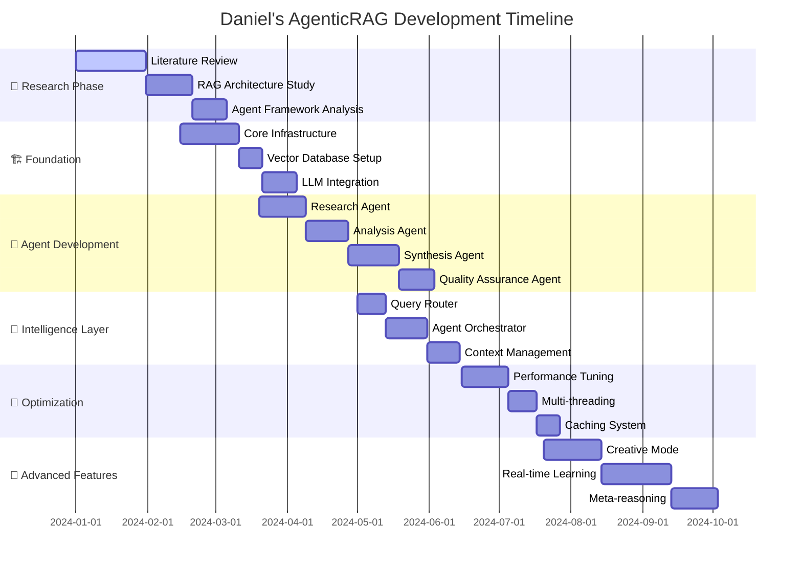
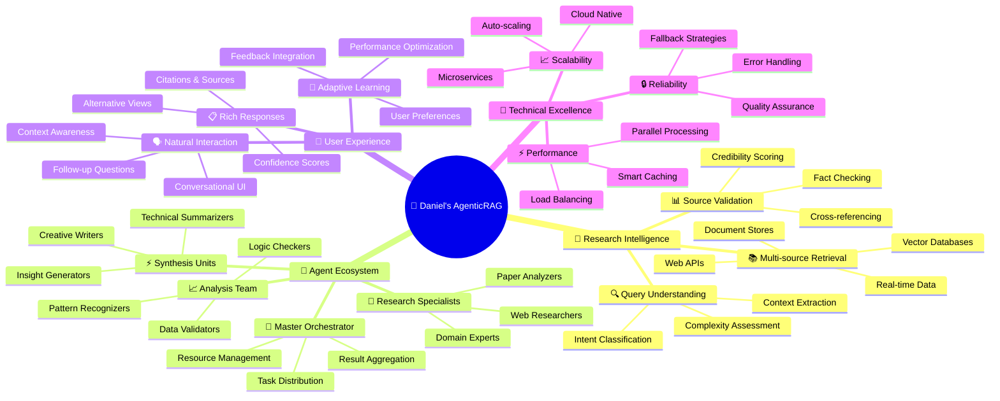

# 📅 Daniel's AgenticRAG Development Journey

## Project Timeline



## Feature Evolution Map

```mermaid
gitgraph
    commit id: "🎯 Initial Concept"
    branch basic-rag
    checkout basic-rag
    commit id: "📚 Simple RAG"
    commit id: "🔍 Vector Search"
    
    checkout main
    merge basic-rag
    commit id: "🤖 First Agent"
    
    branch multi-agent
    checkout multi-agent
    commit id: "🔬 Research Agent"
    commit id: "📊 Analysis Agent"
    commit id: "⚡ Synthesis Agent"
    
    checkout main
    branch intelligence
    checkout intelligence
    commit id: "🧭 Smart Router"
    commit id: "🎼 Orchestrator"
    
    checkout multi-agent
    commit id: "🔄 Agent Communication"
    commit id: "🧠 Collective Intelligence"
    
    checkout main
    merge multi-agent
    merge intelligence
    commit id: "🚀 V1.0 Release"
    
    branch advanced
    checkout advanced
    commit id: "🎨 Creative Mode"
    commit id: "📈 Real-time Learning"
    commit id: "🔮 Meta-reasoning"
    
    checkout main
    commit id: "🌟 Current State"
```

## Daniel's Innovation Mindmap

