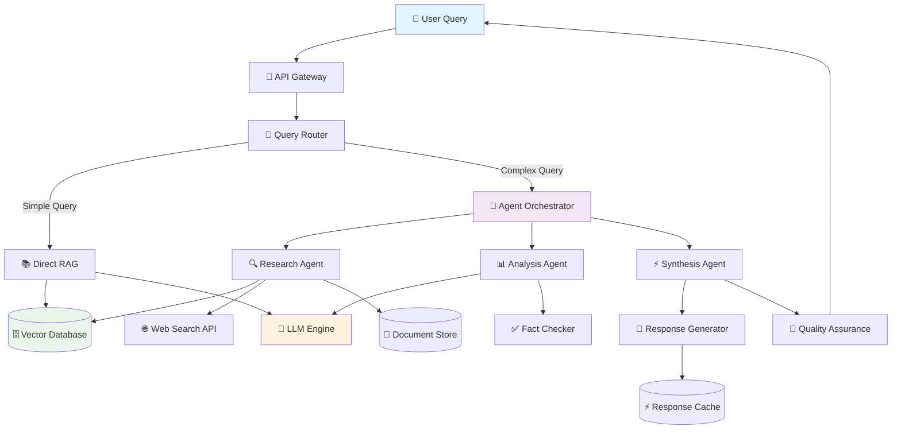
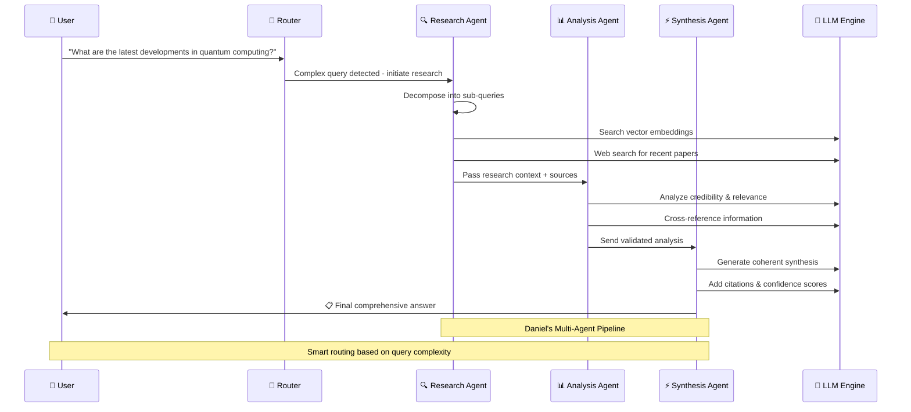

# 🤖 AgenticRAG: Daniel's Multi-Agent RAG System

## System Architecture Overview

```mermaid
graph TB
    User[👤 User Query] --> Gateway[🚪 API Gateway]
    Gateway --> Router[🧭 Query Router]
    
    Router --> |Simple Query| DirectRAG[📚 Direct RAG]
    Router --> |Complex Query| AgentOrch[🤖 Agent Orchestrator]
    
    AgentOrch --> ResearchAgent[🔍 Research Agent]
    AgentOrch --> AnalysisAgent[📊 Analysis Agent] 
    AgentOrch --> SynthAgent[⚡ Synthesis Agent]
    
    ResearchAgent --> VectorDB[(🗄️ Vector Database)]
    ResearchAgent --> WebSearch[🌐 Web Search API]
    ResearchAgent --> DocStore[(📄 Document Store)]
    
    AnalysisAgent --> LLMEngine[🧠 LLM Engine]
    AnalysisAgent --> FactCheck[✅ Fact Checker]
    
    SynthAgent --> ResponseGen[📝 Response Generator]
    SynthAgent --> QualityCheck[🎯 Quality Assurance]
    
    DirectRAG --> VectorDB
    DirectRAG --> LLMEngine
    
    ResponseGen --> Cache[(⚡ Response Cache)]
    QualityCheck --> User
    
    style User fill:#e1f5fe
    style AgentOrch fill:#f3e5f5
    style LLMEngine fill:#fff3e0
    style VectorDB fill:#e8f5e8
```

## Daniel's Agent Collaboration Flow

```mermaid
sequenceDiagram
    participant U as 👤 User
    participant R as 🧭 Router
    participant RA as 🔍 Research Agent
    participant AA as 📊 Analysis Agent
    participant SA as ⚡ Synthesis Agent
    participant L as 🧠 LLM Engine

    U->>R: "What are the latest developments in quantum computing?"
    R->>RA: Complex query detected - initiate research
    RA->>RA: Decompose into sub-queries
    RA->>L: Search vector embeddings
    RA->>L: Web search for recent papers
    RA->>AA: Pass research context + sources
    AA->>L: Analyze credibility & relevance
    AA->>L: Cross-reference information
    AA->>SA: Send validated analysis
    SA->>L: Generate coherent synthesis
    SA->>L: Add citations & confidence scores
    SA->>U: 📋 Final comprehensive answer
    
    Note over RA,SA: Daniel's Multi-Agent Pipeline
    Note over U,SA: Smart routing based on query complexity
```