# 👥 Daniel's User-Centric AgenticRAG Experience

## User Journey Flow

## Conversation Flow Patterns

```mermaid
flowchart TD
    Start([👋 User Arrives]) --> Welcome{First Visit?}
    Welcome -->|Yes| Onboard[🎯 Show Capabilities]
    Welcome -->|No| Direct[💬 Direct to Chat]
    
    Onboard --> Examples[📚 Show Examples]
    Examples --> Direct
    
    Direct --> Query[❓ User Query]
    Query --> Classify{Query Type?}
    
    Classify -->|Simple Fact| QuickPath[⚡ Quick Answer]
    Classify -->|Complex Research| DeepPath[🔬 Deep Analysis]
    Classify -->|Creative Task| CreativePath[🎨 Creative Mode]
    Classify -->|Follow-up| ContextPath[🔄 Context Aware]
    
    QuickPath --> VectorSearch[📊 Vector Search]
    VectorSearch --> SimpleAnswer[💬 Direct Response]
    
    DeepPath --> MultiAgent[🤖 Multi-Agent Process]
    MultiAgent --> Research[🔍 Research Phase]
    Research --> Analysis[📈 Analysis Phase] 
    Analysis --> Synthesis[⚡ Synthesis Phase]
    Synthesis --> RichAnswer[📋 Comprehensive Response]
    
    CreativePath --> Exploration[🌟 Explore & Connect]
    Exploration --> Innovation[💡 Generate Ideas]
    Innovation --> CreativeAnswer[🎨 Creative Response]
    
    ContextPath --> Memory[🧠 Access Memory]
    Memory --> Continuation[🔄 Continue Conversation]
    Continuation --> ContextAnswer[💭 Contextual Response]
    
    SimpleAnswer --> Feedback{Satisfied?}
    RichAnswer --> Feedback
    CreativeAnswer --> Feedback
    ContextAnswer --> Feedback
    
    Feedback -->|Yes| Share[📤 Share/Save Option]
    Feedback -->|No| Refine[🔧 Refine Request]
    Feedback -->|Partially| FollowUp[❓ Follow-up Questions]
    
    Share --> End([✅ Session Complete])
    Refine --> Query
    FollowUp --> ContextPath
    
    style Start fill:#e1f5fe
    style MultiAgent fill:#f3e5f5
    style End fill:#e8f5e8
```

## Interaction Design System

## Performance & Satisfaction Metrics

## Agent Personality Showcase

```mermaid
graph TB
    subgraph "🔬 Research Agent: Dr. Digger"
        R1[🎯 Precision Focused]
        R2[📚 Source Obsessed] 
        R3[🔍 Detail Oriented]
        R4[⏰ Thorough but Fast]
    end
    
    subgraph "📊 Analysis Agent: Prof. Logic"
        A1[🧮 Data Driven]
        A2[🔗 Connection Finder]
        A3[⚖️ Bias Detector]
        A4[📈 Pattern Recognizer]
    end
    
    subgraph "⚡ Synthesis Agent: Creative Clara"
        S1[🎨 Eloquent Writer]
        S2[🌈 Creative Connector]
        S3[📝 Story Teller]
        S4[💡 Insight Generator]
    end
    
    subgraph "✅ Quality Agent: Judge Careful"
        Q1[🎯 Accuracy Validator]
        Q2[📏 Completeness Checker]
        Q3[👤 User Focus]
        Q4[🏆 Excellence Pursuer]
    end
    
    style R1 fill:#e3f2fd
    style A1 fill:#f3e5f5
    style S1 fill:#fff8e1
    style Q1 fill:#e8f5e8
```

